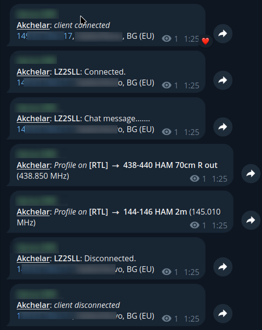
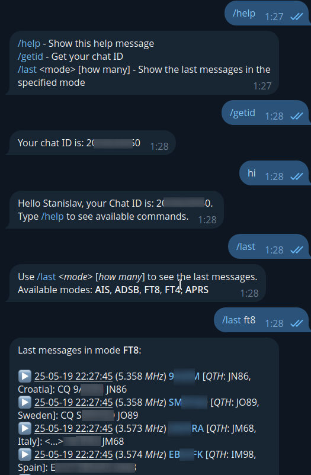

# openwebrx-telegram-bot

Telegram bot reporting OpenWebRX MQTT events to @YourChannel or in private message.

## Overview

**openwebrx-telegram-bot** listens to MQTT events from an OpenWebRX server and sends notifications to a specified Telegram chat. It provides real-time updates about client connections, disconnections, chat messages, receiver profile changes, etc.

## ChangeLog

See [ChangeLog](CHANGELOG.md) for more info.

## Features

- The bot will reply to some [Commands](#commands)
- Includes offline geolocation lookup for client IP addresses. You need maxmind.com free license key. (**WARNING**: Keep in mind that the first run will take few minutes to cache the GeoIP data)
- The Bot will reply to your private messages with your Chat ID (so you can use it later in the config)

## Commands

- /help - show help
- /whoami | /getid - reply with ChatID of the user, who sent the command
- /last <`mode`> [`how_many`] - reply with last messages from background decoders

## Admin Commands

- /reportbanned <on|off> - Report banned clients to the chat when they try to connect.
- /alias <`add` | `del`> <`name`> <`CIDR`> - add alias for IP or Network address, one alias can have multiple CIDR

## Screenshots




## Requirements

- Node.js
- A working MQTT Broker.
- Access to an MQTT broker used by OpenWebRX. [Configure MQTT in OpenWebRX](#configure-mqtt-in-openwebrx).
- Telegram Bot Token. [Setup Telegram Bot](#setup-telegram-bot).
- MaxMind GeoIP API License key (for database updates). [Register](https://maxmind.com) for a free account and get a License Key.

## Docker Installation (recomended)

You can run the bot using Docker. This is the easiest way to get started if you don't want to install Node.js and dependencies manually.

1. Get the docker image by one of the following methods:

    - Pull from Docker Hub:

        ```sh
        docker pull slechev/openwebrx/telegram-bot
        ```

    - Or build it yourself:

        ```sh
        docker build -t openwebrx-telegram-bot .
        ```

2. Create a `.env` file in the project directory with your configuration (see above for required variables).

3. Run the container, mounting the directories for Bot and GeoIP data and using the .env file:

    - Docker stand alone:

        ```sh
        docker run --env-file .env -v /tmp/geoip:/tmp/geoip -v /tmp/owrx-bot:/data slechev/openwebrx-telegram-bot
        ```

    - Docker Compose (recommended for easy management):

        1. Copy the example compose file:

            ```sh
            cp docker-compose-example.yml docker-compose.yml
            ```

        2. Edit `docker-compose.yml` and `.env` as needed.

        3. Start the container:

            ```sh
            docker compose up -d
            ```

This will start the bot inside a container, using your environment variables and the GeoIP database directory.

## Native Installation

1. Clone the repository:

   ```sh
   git clone https://github.com/0xAF/openwebrx-telegram-bot.git
   cd openwebrx-telegram-bot
   ```

1. Install dependencies:

    ```sh
    npm install
    ```

1. Configure environment variables by editing the .env file:

    ```sh
    MQTT_BROKER_URL="mqtt://your-mqtt-broker:1883"
    MQTT_USERNAME=
    MQTT_PASSWORD=
    BOT_ADMIN_ID=xxxxxxxxxxxxx # your telegram user id
    BOT_TOKEN=your_telegram_bot_token
    BOT_CHAT_ID=your_telegram_chat_id
    MAXMIND_API_KEY=your_maxmind_api_key
    GEODATADIR=/tmp/geoip # absolute path (do not use for docker installations)
    DATA_DIR=/tmp/owrx-bot # absolute path (do not set for docker installations, use volume or bind-mount to /data)
    #DEBUG=bot:*,-bot:Decoders # if you want to see debug, without the decoders spam
    ```

1. Update GeoIP database:

    ```sh
    ./update-geoip-db.sh
    ```

1. Start the bot:

    ```sh
    npm run start
    ```

## Usage

The bot will connect to the MQTT broker and start sending notifications to the configured Telegram chat.

| Variable           | Description                                                     | Required |
|--------------------|-----------------------------------------------------------------|----------|
| MQTT_BROKER_URL    | URL of the MQTT broker                                          | Yes      |
| MQTT_TOPIC_BASE    | MQTT base topic for subscription (default: openwebrx)           | No       |
| MQTT_USERNAME      | MQTT broker username                                            | No       |
| MQTT_PASSWORD      | MQTT broker password                                            | No       |
| BOT_TOKEN          | Telegram bot token                                              | Yes      |
| BOT_CHAT_ID        | Telegram chat ID (e.g., `@YourChannel` or chat numeric ID)      | Yes      |
| BOT_ADMIN_ID       | Your Telegram user ID                                           | Yes      |
| MAXMIND_API_KEY    | MaxMind GeoIP API key (for DB updates)                          | Yes      |
| GEODATADIR         | Directory for geolocation data files (Do not change for Docker) | No       |
| DATA_DIR           | Directory for bot data (Do not change for Docker)               | No       |
| DEBUG              | Print DEBUG info to the console (use DEBUG=bot:*)               | No       |

## Configure MQTT in OpenWebRX

- Open OpenWebRX Settings page.
- Go to "Spotting and reporting".
- Find "MQTT settings" section.
- Fill the required data.
- Set the "MQTT topic" to "`openwebrx/YourReceiverShortName`"

## MQTT Topics

The bot subscribes to the following MQTT topics from OpenWebRX:

- `openwebrx/+/CLIENT` — for client connection, disconnection, and chat messages
- `openwebrx/+/RX` — for receiver profile changes

This is due to support multiple OpenWebRx receivers in one MQTT broker. You should set the "MQTT topic" in OpenWebRx to "`openwebrx/ReceiverShortName`"

## Setup Telegram Bot

- Create new Bot with @BotFather. See [instructions](https://core.telegram.org/bots/features#creating-a-new-bot).
- Get the Token and set it in your `.env` file.
- (Optionaly) Create a Channel and add the Bot to the channel (with admin role).

## License

MIT License. See LICENSE for details.
